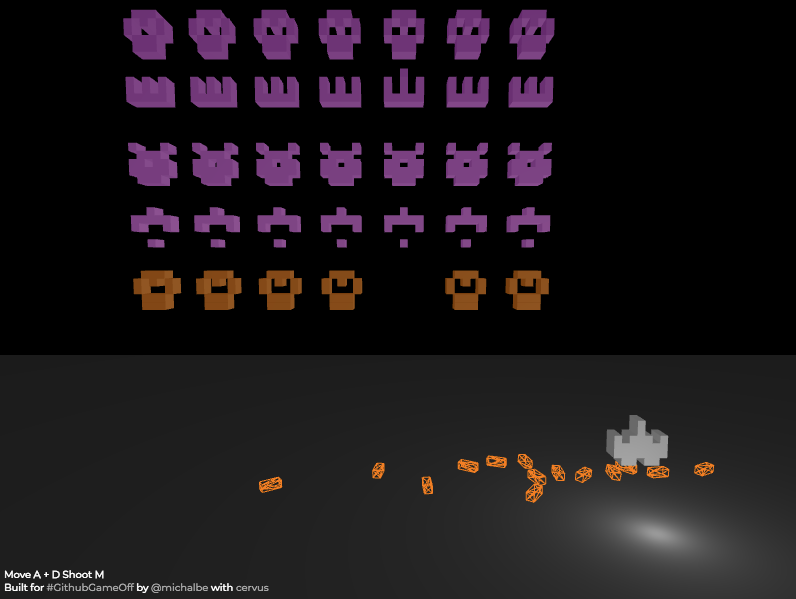

Procedural Invaders
---
by @[michalbe](http://github.com/michalbe) for [#GithubGameOff2017](https://twitter.com/hashtag/GitHubGameOff?src=hash)

### What
Simple Space Invaders clone in WebGL with procedurally generated enemies.

### How
  - `Procedural Invaders` is built using [Cervus](https://github.com/michalbe/cervus), my own simple WebGL game engine.
  - Enemies are randomly generated using `seed` provided by the location hash in the URL. I encourage you to experiment with different hashes.
  - Move with `A` & `D`, and shoot with `M`. You know the rules already, you've been here 40 years ago.

### Why
`Procedural Invaders` is my entry for [Github Game off 2017](https://itch.io/jam/game-off-2017). You can play it:
  - on [Github](https://michalbe.github.io/procedural-invaders/)
  - on [Itch.io](https://michalbe.itch.io/procedural-invaders)

Thanks.
